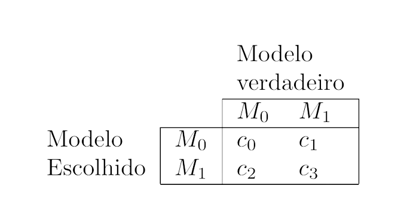

```{css, echo=FALSE}
#content{
    max-width:1200px;
}
```


```{r setup, include=FALSE}
knitr::opts_chunk$set(
	fig.height = 6,
	fig.width = 10,
	message = FALSE,
	warning = FALSE
)
library(tidyverse)
library(latex2exp)
library(rmdformats)
 options(scipen=99)
```


# Introdução

Este documento tem como intuito apresentar o pacote GDLM para ajuste de Modelos Dinâmicos Lineares Generalizados, em especial, para modelos com múltiplos desfechos.

Antes de apresentar o pacote, é importante ressaltar que este ainda é um trabalho em progresso, de modo que as funcionalidades mais recentes ainda podem apresentar comportamentos inesperados. Nesse sentido, o pacote está disponível apenas para uso experimental.

O primeiro passo para o uso do pacote é, naturalmente, a sua instalação. A versão mais recente do pacote está sempre disponível [neste repositório](https://github.com/silvaneojunior/GDLM). O processo de instalação pode ser trivialmente realizado através do seguinte comando:

```{r eval=FALSE}
devtools::install_github('silvaneojunior/GDLM')
```

Uma vez instalado o pacote, basta importa-lo como qualquer outra biblioteca:

```{r eval=FALSE, include=FALSE}
library(GDLM)
```

# Ajuste de modelos univariados

## Metodologia

Suponha que temos um conjunto de observações $Y_t$, $t=1,...,T$, tais que:

$$
\begin{aligned}
Y_t|\eta_t &\sim \mathcal{F}(\eta_t),\\
g(\eta_t)&=F_t'\theta_t,\\
\theta_t&=G_t\theta_{t-1}+\epsilon_t,\\
\epsilon_t &\sim \mathcal{N}(0,W_t),\\
\theta_0 &\sim \mathcal{N}(m_0,C_0),
\end{aligned}
$$


onde $\mathcal{F}$ é uma distribuição de probabilidade pertencente à família exponencial e indexada pelo parâmetro $\eta_t$, $g$ é a função de ligação, $F_t$ é a matriz de planejamento, $G_t$ é a matriz que define a evolução temporal do modelo, $\epsilon_t$ é um ruído com distribuição Normal multivariada e $W_t$ é uma matriz de covariância conhecida. 

Seguindo a abordagem Bayesiana, para fazer inferência sobre $\theta_t$ (para qualquer $t$), precisamos obter sua distribuição a posteriori $\theta_t|\mathcal{D}_T$, onde $\mathcal{D}_t=\{\mathcal{D}_0,y_1,...,y_t\}$ e $\mathcal{D}_0$ representa nosso conhecimento antes de observar os dados. Se $\mathcal{F}$ for a distribuição Normal com variância conhecida e $g$ for a função identidade, então podemos obter de forma analítica a distribuição de $\theta_t|\mathcal{D}_T$, que é Normal e seu vetor de médias e matriz de covariância podem ser obtidos de forma sequencial e computacionalmente barata através do filtro e suavizador de Kalmann. Infelizmente, se $\mathcal{F}$ é qualquer outra distribuição além da Normal com variância conhecida, então não existe forma analítica fechada para a distribuição de $\theta_t|\mathcal{D}_T$, nesse caso, poderíamos fazer inferência sobre $\theta_t$ usando métodos de MCMC, mas isso incorre em um custo computacional elevado. Além disso, o uso de métodos de MCMC para aproximar $\theta_t|\mathcal{D}_T$ leva a perda da estimação sequencial dos parâmetros, ou seja, após o ajuste do modelo, caso queiramos atualizar a informação sobre $\theta_t$ com a informação vinda de um novo conjunto de observações teríamos de reajustar o modelo desde o início. 

Uma alternativa para o ajuste via MCMC foi proposta em @AlvesGDLM. A ideia deste trabalho é aproximar a distribuição de $\theta_t|\mathcal{D}_T$ por uma distribuição com propriedade convenientes usando argumentos de Geometria da Informação, desta forma, podemos obter uma forma analítica aproximada para a posteriori de $\theta_t$ que é virtualmente igual a distribuição exata, mas analiticamente tratável. Para explicar como funciona a metodologia, vamos apresentar o processo de atualização dos parâmetros para uma observação, sendo que, para o ajuste completo do modelo basta repetir esse procedimento para cada valor observado na amostra.

Como critério para aproximar duas distribuições de probabilidade, usaremos como referência a divergência de Kullback-Leibler, de modo que, vamos considerar que a distribuição $q$ pertencente a família $Q$ (contida na família exponencial) que melhor aproxima a distribuição $p$ (também pertencente à família exponencial) é aquela que minimiza $KL(p||q)$, isto é, é aquela que minimiza a divergência de $q$ para $p$. Para encontrar a distribuição $q$ que minimiza $KL(p||q)$, podemos usar o seguinte resultado:

**Teorema da Projeção**: Sejam $p$ e $q$ duas distribuições de variáveis aleatórias contínuas pertencentes à família exponencial, isto é, tais que existem densidades de probabilidade $f_p$ e $f_q$ associadas, respectivamente, a $p$ e $q$, tais que:
\begin{equation}
\label{formTeo2}
\begin{aligned}
f_p(x)&=\exp\left\{\lambda_p \cdot H_p(x) - A_p(\lambda_p) + B_p(x) \right\},\\
f_q(x)&=\exp\left\{\lambda_q \cdot H_q(x) - A_q(\lambda_q) + B_q(x) \right\}.
\end{aligned}
\end{equation}
Então, fixados os parâmetros $\lambda_p$ associados à distribuição $p$, os parâmetros $\lambda_q$ da distribuição $q$ que minimizam a divergência KL são únicos (quando existem) e satisfazem o seguinte sistema:
\begin{equation}
\label{Teom2}
\mathbb{E}_p[H_q]=\mathbb{E}_q[H_q].
\end{equation}
Vale ainda que, se existe $\lambda_q$ que satisfaz o sistema acima, então existe um mínimo para a divergência KL com relação a $\lambda_q$ e a solução para o sistema é única.

Com este teorema em mente, podemos prosseguir com a apresentação da metodologia. A ideia principal é usar o Teorema da Projeção para aproximar a priori dos parâmetros $\eta_t$ (induzida pela priori de $\theta_t$) por uma priori que conjuga com a distribuição de $Y_t$, desta forma podemos obter a posteriori para $\eta_t$ e depois usar o Teorema da Projeção para aproximar a posteriori de $\theta_t$ (induzida pela posteriori de $\eta_t$) por uma gaussiana. 

O algoritmo para atualização dos parâmetros em um passo pode ser sintetizado da seguinte forma:

- **Passo 0**: Suponhamos que $\theta_{t-1}|\mathcal{D}_{t-1} \sim \mathcal{N}(m_{t-1},C_{t-1})$. Representaremos as estatísticas suficientes de uma distribuição $p$ pertencente à família exponencial como $H_p$ e o valor esperado de uma função $f$ de uma variável aleatória $X$ sob a distribuição $p$ como $\mathbb{E}_p[f(X)]$.
- **Passo 1**: Calcular $a_t=G_tm_{t-1}$ e $R_t=G_{t}'C_{t-1}G_t$.
- **Passo 2**: Calcular $f_t=F_t'a_t$ e $Q_t=F_tR_tF_t'$, a média e a variância do preditor linear $F_t'\theta_t$, cuja distribuição será denotada por $\pi$.
- **Passo 3**: Resolver o sistema $\mathbb{E}_{\pi}[H_{\pi^*}]=\mathbb{E}_{\pi^*}[H_{\pi^*}]$ para obter os parâmetros $\tau_t$ da distribução $\pi^*$ (conjugada).
- **Passo 4**: Atualizar os parâmetros $\tau_t$ da priori conjugada para obter os parâmetros $\tau^*_t$ da posteriori conjugada $\pi^*$.
- **Passo 5**: Resolver o sistema $\mathbb{E}_{\pi}[H_{\pi}]=\mathbb{E}_{\pi^*}[H_{\pi}]$ para obter os parâmetros $f^*_t$ e $Q^*_t$ da posteriori Normal para os preditores lineares.
- **Passo 6**: Obter $m_{t}$ e $C_{t}$ a partir de $f^*_t$ e $Q^*_t$.

Como um "bônus" dessa metodologia, uma vez que temos uma distribuição para $\eta_t$ que conjuga com a distribuição de $Y_t$, podemos obter de forma analítica a distribuição preditiva de $Y_t$, i.e., podemos obter de forma analítica a distribuição de $Y_t|\mathcal{D}_{t-1}$.

## Ajuste com o pacote

A principal função do pacote é chamada *fit_model* e serve justamente para ajustar os modelos. O uso dessa função é feito da seguinte forma:

```{r eval=FALSE}
fit_model(
  ...,
  outcomes,
  offset = outcomes * 0 + 1,
  pred_cred = 0.95,
  smooth_flag = TRUE,
  p_monit = NA,
  c_monit = 1
)
```

Os argumentos não nomeados desta função são os blocos estruturais que compõe o modelo (blocos harmônicos, polinomiais, AR, etc.) e são responsáveis por estabelecer a dinâmica temporal do modelo e a relação entre as variáveis latentes e os preditores lineares (é possível que exista mais de um). Além da estrutura do modelo, o usuário deve passar um lista de valores como *outcome* que serão usados como desfecho para o ajuste do modelo. Os desfechos do modelo devem ser passados como uma lista contendo cada desfecho separadamente. Para especificar os desfechos, as funções de distribuição devem ser usadas, atualmente as seguintes funções estão disponíveis:

- Poisson;
- Gamma;
- Normal;
- Multinom.

Em cada uma dessas funções o usuário deve especificar os valores observados, o *offset* (opcional) e os preditores lineares associados aos parâmetros. Para exemplificar o uso, olhemos mais de perto a função *Normal*:

```{r eval=FALSE}
Normal(
  mu,
  tau=NA,
  sigma=NA,
  sigma2=NA
  outcome,
  offset=outcome**0,
  family=normal_gamma_cor_kernel
)
```

O argumento *mu* deve ser uma *string* com o nome do preditor linear associado à média das observações e, de forma análoga, o argumento *tau*, *sigma* e *sigma2* devem ser *strings* com o nome do preditor linear associado à precisão das observações (apenas um deles deve ser especificado). No caso específico dos parâmetros associados a escala, o usuário pode optar por especificar um valor numérico, desta forma o código entenderá que a escala do dado é conhecida. Veremos mais a frente, durante a criação dos blocos de variáveis, como os preditores lineares são criados.

Cada distribuição tem sua própria função para criação do desfecho, sendo a sintaxe delas bem parecida, a única diferença notável sendo o nome e a quantidade de parâmetros que devem ser especificados.

É importante observar que todas as funcionalidades do pacote estão disponíveis para todas as possíveis famílias de distribuição do desfecho.

As informações acima são apenas um breve resumo do uso da função *fit_model*, mais informações e exemplos de uso estão disponíveis no *help*.

Por último, para que o usuário possa fazer o ajuste de um modelo, resta apenas especificar sua estrutura. Para o ajuste dos modelos, estamos supondo que:

$$
\begin{aligned}
Y_t|\eta_t &\sim \mathcal{F}(\eta_t),\\
g(\eta_t)&=F_t'\theta_t,\\
\theta_t&=G_t\theta_{t-1}+\epsilon_t,\\
\epsilon_t &\sim \mathcal{N}(0,W_t),
\end{aligned}
$$
onde $\mathcal{F}$ é uma das distribuições disponíveis do pacote e é indexada pelo parâmetro $\eta_t$, $g$ é a função de ligação, $F_t$ é a matriz de planejamento, $G_t$ é a matriz que define a evolução temporal do modelo, $\epsilon_t$ é um ruído com distribuição Normal multivariada e $W_t$ é uma matriz de covariância conhecida. Uma vez escolhida a família da distribuição do desfecho, $g$ e $\eta$ estarão definidos, restando ao usuário definir $F_t$, $G_t$, $W_t$ e $\theta_t$ (no caso de $\theta_t$, o usuário não irá definir seus valores, mas sim a sua dimensão e uma priori para $\theta_0$).

Para auxiliar a definição de $F_t$, $G_t$ e $W_t$, algumas funções são disponibilizadas para criar estruturas já pré-estabelecidas. As funções disponíveis são *polynomial_block*, *harmonic_block*, *AR_block* e *correlation_block* (mais opções estão em desenvolvimento). A sintaxe dessas funções é bem semelhante, assim, discutiremos apenas o uso da função *polynomial_block*, sendo que o uso das outrás é análogo (para mais detalhes sobre as outros ver o *help*). A função *polynomial_block* deve ser usada da seguinte forma:

```{r eval=FALSE}
polynomial_block(
  ...,
  order,
  name = "Var_Poly",
  D = 1,
  W = 0,
  m0 = 0,
  C0 = 1
)
```

Para esta função, o argumento "*...*" deve representar os preditores lineares associados a este bloco de variáveis. Por exemplo, digamos que as variáveis deste bloco tem efeito $1$ sobre um preditor linear *lambda*, ademais, vamos supor que este bloco seja um bloco polinomial de ordem 2, então o uso da função seria:

```{r eval=FALSE}
polynomial_block(
  lambda=1,
  order=2
)
```

Um outro exemplo importante de se mostrar seria o caso onde temos uma regressora *X* com efeito fixo, neste caso podemos criar um bloco para esta regressora da seguinte forma:

```{r eval=FALSE}
polynomial_block(
  lambda=X,
  order=1
)
```

Caso queiramos que o efeito da regressora mude ao longo do tempo, podemos especificar um fator de desconto associado a este bloco:


```{r eval=FALSE}
polynomial_block(
  lambda=X,
  order=1,
  D=1/0.9
)
```

Mais detalhes sobre os demais argumentos dessa função pode ser encontrado no *help*.

É importante notar que o nome do preditor linear pode ser qualquer, desde que seja consistente com o nome usado na criação dos desfechos. Por exemplo, se criamos um desfecho Poisson com taxa associada a um preditor linear *alpha*, então devemos criar um bloco associado a esse preditor, por exemplo:

```{r eval=FALSE}
desfecho1=Poisson(
  lambda='alpha',
  outcome=Y
)

bloco1=polynomial_block(
  alpha=X,
  order=1
)
```

Adiante apresentamos um exemplo completo com o ajuste de dados simulados para um modelo dinâmico Poisson:

```{r echo=FALSE}
devtools::load_all()
# Simulando dados para o exemplo
set.seed(13031998)
T <- 200
w <- (200 / 40) * 2 * pi
outcome <- rpois(T, exp(2 + (sin(w * 1:T / T))))

```


```{r}
# Criando estrutura de primeira ordem para o modelo.
level <- polynomial_block(lambda=1,order = 1, D = 1 / 0.95,name='nivel')
# Criando estrutura sazonal para o modelo
season <- harmonic_block(lambda=1,period = 40, D = 1 / 0.98,name='sazonalidade')
# O argumento D é um argumento auxiliar que permite a especificação da matriz W_t através de fatores de desconto.
# Vale observar que, no modelo Poisson, estaremos colocando estrutura sob o logaritmo da taxa.
# Ademais, o argumento name é opcional em todos os blocos, porém ele é útil para facilitar a identificação das variáveis após o ajuste do modelo

tempo_inicial=Sys.time()
fitted_data <- fit_model(level, season, outcomes = list(Poisson(lambda='lambda',outcome=outcome)))
cat(paste0('Tempo gasto para o ajuste: ',round(Sys.time()-tempo_inicial,3),' segundos.'))

# A função show_fit é uma função auxiliar para a exibição do modelo ajustado
show_fit(fitted_data, smooth = TRUE)$plot

# A função plot_lat_var é uma função auxiliar para a exibição dos parâmetros latentes
# Essa função exige que você especifique os parâmetros a serem plotados pelo nome dado durante a criação (caso o usuário não tenha especificado um nome, são dados nomes padrões)
# Caso o usuário queira visualizar todas as variáveis, basta passar uma string vazia
plot_lat_var(fitted_data, 'sazonalidade')$plot
plot_lat_var(fitted_data, '')$plot

# É válido destacar que, apesar dos gráficos default serem dinâmicos, é possível solicitar também gráficos estáticos. Nesse caso, as funções auxiliares retornarão um objeto do ggplot que pode ser modificado pelo usuário.
```


# Ajuste de modelos multivariados

## Metodologia

A metodologia descrita para modelos univariados pode ser facilmente expandida para modelos multivariados, para isso, suponha que tenhamos $r$ séries temporais $\{Y_{1t}\}_{t=1}^T,...,\{Y_{rt}\}_{t=1}^T$ tais que:

- $Y_{it}|\theta_t$ tem distribuição pertencente à família exponencial.
- $Y_{1t},...,Y_{rt}$ são independentes dado $\theta_t$.

Sob as condições acima podemos escrever a posteriori de $\theta$ no tempo $t$ como:

$$
\pi(\theta_t|\mathcal{D}_t)\propto\pi(\theta_t|\mathcal{D}_{t-1})\prod_{i=1}^{r}f(y_{it}|\theta_t).
$$

Observe que podemos obter uma forma analítica aproximada para $\pi(\theta_t|\mathcal{D}_{t-1})f(y_{1t}|\theta_t)  \propto \pi(\theta_t|\mathcal{D}_{t-1},y_{1t})$ usando a metodologia descrita para o caso univariado, assim, podemos escrever:

$$
\pi(\theta_t|\mathcal{D}_t)\propto\pi(\theta_t|\mathcal{D}_{t-1},y_{1t})\prod_{i=2}^{r}f(y_{it}|\theta_t).
$$

É fácil ver que, repetindo o processo acima $r$ vezes, podemos obter uma forma analítica aproximada para a posteriori de $\theta_t$. Observe que a relação descrita na equação acima é exata, isto é, não estamos fazendo nenhum tipo de aproximação além daquela feita no caso univariado, ou seja, essa abordagem para o ajuste de múltiplas séries não introduz nenhum tipo de erro extra no ajuste. Por último, é importante destacar que a distribuição marginal de cada série pode ser qualquer (desde que pertença à família exponencial), ou seja, podemos modelar conjuntamente qualquer combinação desejada de séries, desde que possamos modelar cada série individualmente.

Um detalhe importante sobre essa abordagem é que, teoricamente, a ordem na qual incorporamos a informação de cada série não afeta o resultado final, contudo, na prática esse não é o caso, pois, apesar da posteriori ser a mesma independente da ordem na qual incorporamos a informação, o erro de aproximação associado ao ajuste univariado pode ser diferente dependendo da ordem dos ajustes. Contudo, pude verificar que a ordem em que as séries são processadas afeta de forma significativa apenas as primeiras iterações, i.e., independente da ordem em que a informação é incorporada, a posteriori aproximada converge rapidamente para a posteriori exata.

Uma característica a ser destacada é que, nessa abordagem, as séries são independentes entre si dado os parâmetros latentes, isto é, as séries dependem umas das outrás exclusivamente através dos parâmetros latentes, assim, o usuário do pacote deverá definir a estrutura de dependência entre as séries, de outra forma o resultado do ajuste será igual ao obtido ajustando cada série de forma independente.


## Ajuste com o pacote

O ajuste de séries multivariadas é análogo ao de séries univariadas, sendo necessário apenas que o usuário crie múltiplos desfechos para o modelo. Adiante apresentamos um código para o ajuste conjunto de duas séries Poisson:

```{r echo=FALSE}
devtools::load_all()
# Simulando dados para o exemplo
set.seed(13213245)
T <- 200
w <- (200 / 40) * 2 * pi
mu1=2
mu2=4
mu3=cumsum(rnorm(T,0,0.1))

outcome1 <- rpois(T, exp(mu1+mu3))
outcome2 <- rpois(T, exp(mu2+mu3))


```


```{r}
# O modelo definido desta forma está mal especificado: Há um parâmetro sobrando
# Criando estrutura de primeira ordem para o modelo.
level1 <- polynomial_block(lambda1=1,order = 1, D = 1 / 1,name='nivel')
# Criando estrutura de primeira ordem para o modelo.
level2 <- polynomial_block(lambda2=1,order = 1, D = 1 / 1,name='nivel')
# Criando estrutura de primeira ordem para o modelo.
level_conj <- polynomial_block(lambda1=1,lambda2=1,order = 1, D = 1 / 0.95,name='nivel')

tempo_inicial=Sys.time()
fitted_data <- fit_model(level1, level2,level_conj,
                         outcomes = list(desfecho1=Poisson(lambda='lambda1',outcome=outcome1),
                                         desfecho2=Poisson(lambda='lambda2',outcome=outcome2)))
cat(paste0('Tempo gasto para o ajuste: ',round(Sys.time()-tempo_inicial,3),' segundos.'))

# A função show_fit é uma função auxiliar para a exibição do modelo ajustado
show_fit(fitted_data, smooth = TRUE)$plot
```

## Ajuste para o caso Normal multivariado

A abordagem acima é bem geral e interessante, infelizmente ela não cobre o caso Normal multivariado com matriz de covariância cheia, pois, neste caso, não vale que as séries são independentes dado os parâmetros latentes. Podemos contornar isso de duas formas, a primeira é observa que, se temos duas variáveis aleatórias $X$ e $Y$ tais que:

$$
X,Y \sim \mathcal{N}\left(\begin{bmatrix}\mu_X\\\mu_Y\end{bmatrix},\Sigma\right),
$$
então podemos escrever:

$$
\begin{aligned}
X=\mu_X+\epsilon,\\
Y=\mu_Y+\omega,
\end{aligned}
$$
Com $\epsilon,\omega \sim \mathcal{N}\left(\vec{0},\Sigma\right)$. A primeira proposta então se baseia no fato de que este modelo é equivalente à:

$$
\begin{aligned}
X=&\mu_X+\alpha Z+\epsilon^*,\\
Y=&\mu_Y+\beta Z+\omega^*,
\end{aligned}
$$
onde $Z \sim \mathcal{N}(0,1)$, $\epsilon^*$ e $\omega^*$ são independentes e $\alpha$ e $\beta$ são parâmetros a serem estimados. Nesse modelo temos que $X$ e $Y$ são independentes dado os parâmetros latentes (que incluem o $Z$) e a matriz de correlação condicionada a $\mu_X$, $\mu_Y$, $\alpha$ e $\beta$ (mas não à $Z$) é tal que:

$$
\begin{aligned}
Var[X|\mu_X, \mu_Y, \alpha, \beta]&=\alpha^2+Var[\epsilon^*],\\
Var[Y|\mu_X, \mu_Y, \alpha, \beta]&=\beta^2+Var[\omega^*],\\
Cov[X,Y|\mu_X, \mu_Y, \alpha, \beta]&=\alpha\beta.
\end{aligned}
$$

Infelizmente, como estaremos estimando $\alpha$, $\beta$ e $Z$, temos que o nosso modelo tem uma estrutura não linear para o preditor $\eta_t$, o que, a princípio, inviabiliza o ajuste usando a metodologia proposta em @AlvesGDLM.

Uma forma de ser resolver esse problemas seria através de uma linearização (capítulo 13 do @WestHarrDLM). Implementamos essa abordagem no pacote e algumas análises foram feitas sobre a qualidade do ajuste. Através das análises que fizemos, observamos que, em geral, o ajuste fica adequado, porém, infelizmente, é necessário que o usuário forneça prioris informativas para $\alpha$ e $\beta$. Felizmente, encontramos uma heurística simples e muito eficiente para a escolha da priori, basta tomar $\alpha=1$ com probabilidade $1$ (a priori para $\beta$ pode ser qualquer).

O ajuste desse modelo pode ser feito através do pacote GDLM usando a função *correlation_block* para criar a estrutura de dependência descrita anteriormente. Adiante vamos exibir o ajuste de um modelo para um conjunto de dados com distribuição Normal bivariada com média e variância fixas e com um passeio aleatório na correlação:

```{r echo=FALSE}
devtools::load_all()

# Criando dados

T <- 200
#S=exp(-10*(1:T/T)*((1:T/T)-1))
set.seed(13031998)
out=matrix(NA,T,2)
mu=c(1,-1)

rho=0
rhos=rep(NA,T)
for(i in 1:T){
  rho=rho+rnorm(1,0,0.1)
  rhos[i]=2/(1+exp(-rho))-1
  S=matrix(c(1,rhos[i],rhos[i],1),2,2)
  out[i,] <- mvtnorm::rmvnorm(1,mu,S)
}

out1=out[,1]
out2=out[,2]
```

```{r}
mean1=polynomial_block(mu1=1,order=1)
var1=polynomial_block(tau1=1,order=1)

mean2=polynomial_block(mu2=1,order=1)
var2=polynomial_block(tau2=1,order=1)

cov=correlation_block(var_names = c('mu1','mu2'),
                      m0=c(1,0),
                      C0=matrix(c(0,0,0,100),2,2),
                      D=1/0.9,
                      )
tempo_inicial=Sys.time()
model=fit_model(mean1,mean2,var1,var2,cov,
                outcomes=list(Normal(mu='mu1',tau='tau1',outcome=out1),
                             Normal(mu='mu2',tau='tau2',outcome=out2)))
cat(paste0('Tempo gasto para o ajuste: ',round(Sys.time()-tempo_inicial,3),' segundos.'))

plot(rhos,ylim = c(-1,0.5),main='Evolução da covariância')
lines(model$mts[6,])
lines((model$mts[6,]+2*sqrt(model$Cts[6,6,])),lty=2)
lines((model$mts[6,]-2*sqrt(model$Cts[6,6,])),lty=2)
legend('topright',legend=c('Valor real', 'valor estimado'),pch=c(16,NA),lty=c(NA,1),col=c('black','black'))
```

Uma análise mais detalhada dessa abordagem está em produção e será incluída no texto final da dissertação.

Por último, antes de seguirmos para a segunda abordagem para o ajuste Normal multivariado, é relevante destacar duas vantagens que a abordagem acima trás. A primeira é que ela pode ser usada também para modelar a dependência de outrás séries temporais cuja resposta não é Normal. A segunda vantagem é que essa abordagem pode ser usada para limitar a complexidade da matriz de covariância, de fato, se temos um modelo com a forma:

$$
\begin{aligned}
X=&\vec{\mu}+\vec{\epsilon},\\
\vec{\epsilon}\sim & \mathcal{N}(0,\Sigma),
\end{aligned}
$$
então podemos reescrever esse modelo como:

$$
\begin{aligned}
X=&\vec{\mu}+A \vec{Z}'+\vec{\epsilon}^*,\\
\vec{Z}\sim & \mathcal{N}(0,I),\\
\vec{\epsilon}^*\sim & \mathcal{N}(0,D),
\end{aligned}
$$
com $D$ uma matriz diagonal e $I$ igual a matriz identidade. Então vale que:

$$
Var[X|\vec{\alpha},\vec{\mu}]=AA'+D
$$
Novamente, para que o ajuste funcione de modo adequado, é necessário assumir uma priori informativa para $A$, felizmente a priori anterior pode ser traduzida facilmente para o caso geral, sendo necessário então assumir que $A$ é triangular inferior. Na prática, observamos que, com esta priori, a média a posteriori de $A$ converge para a decomposição de Cholesky de $\Sigma$ (a menos da diagonal principal), desde que $\vec{Z}$ tenha dimensão suficientemente grande.

Se $\vec{Z}$ tem dimensão $k$ e $X$ tem dimensão $r$, então $A$ tem apenas $(r-1/2-k/2)k$ parâmetros a serem estimados, logo, se $k<<r$, temos uma "economia" considerável de parâmetros, uma vez que a matriz de covariância tem $r(r-1)/2$ parâmetros associados com a correlação (se $k=r$ a quantidade de parâmetros será a mesma). Assim, essa abordagem é particularmente interessante para dados com grande dimensão no qual acreditamos que exista uma estrutura latente de baixa dimensão que "rege" os dados.

Passemos então para a segunda abordagem. Desta vez, não vamos supor independência condicionada a $\theta$ para as observações, mas vamos adicionar um preditor linear para a covariância (vamos fazer a descrição para o caso bivariado, mas a abordagem se estende trivialmente para o caso $r$ variado). Sabemos que, se:

$$
Y_{1t},y_{2t}| \theta_t \sim \mathcal{N}_2(\mu_1,\mu_2,\sigma_1^2,\sigma_2^2,\rho).
$$

Então:

$$
Y_{2t}| \theta_t, Y_{1t}=y_{1t} \sim \mathcal{N}(\bar{\mu}_2,\bar{\sigma}_2^2),
$$
com:

$$
\begin{aligned}
\bar{\mu}_2&=\mu_2+\rho\frac{\sigma_2}{\sigma_1}(y_{1t}-\mu_1),\\
\bar{\sigma}_2^2&=(1-\rho^2)\sigma_2^2
\end{aligned} \quad \quad \quad \quad (*)
$$

Com isto, podemos fazer a atualização dos parâmetros da seguinte forma:

- **Passo 0**: Suponha que a distribuição de $\theta_t|\mathcal{D}_{t-1}$ é conhecida.
- **Passo 1**: Utizamos o métodos do artigo para obter a distribuição aproximada de $\theta_t|\mathcal{D}_{t-1},y_{1t}$.
- **Passo 2**: A partir da distribuição de $\theta_t|\mathcal{D}_{t-1},y_{1t}$, podemos obter a distribuição de $\bar{\mu}_2$ e $\bar{\sigma}_2^2$ através da linearização da equação $(*)$, de modo que podemos obter a uma priori Normal para $\bar{\mu}_2$ e $\ln(\bar{\sigma}_2^2)$.
- **Passo 3**: Atualizamos a distribuição de $\bar{\mu}_2$ e $\ln(\bar{\sigma}_2^2)$ usando a abordagem do artigo.
- **Passo 4**: Recuperamos a distribuição de $\theta_t|\mathcal{D}_{t-1},y_{1t},y_{2t}$ a partir da distribuição de $\bar{\mu}_2$ e $\ln(\bar{\sigma}_2^2)$ e da linearização da equação $(*)$.

Usando essa metodologia obtemos o seguinte ajuste (mesmos dados do exemplo anterior):

```{r echo=FALSE, message=FALSE, warning=FALSE}
devtools::load_all('C:\\Jupyter\\Mestrado\\Pacote\\GDLM_new_method\\GDLM')

library(tidyverse)
library(plotly)
library(mvtnorm)

T <- 200
#S=exp(-10*(1:T/T)*((1:T/T)-1))
set.seed(13031998)
outcome=matrix(NA,T,2)
mu=c(1,-1)

rho=0
rhos=rep(NA,T)
for(i in 1:T){
  rho=rho+rnorm(1,0,0.1)
  rhos[i]=2/(1+exp(-rho))-1
  S=matrix(c(1,rhos[i],rhos[i],1),2,2)
  outcome[i,] <- rmvnorm(1,mu,S)
}
```

```{r echo=FALSE, message=FALSE, warning=FALSE}

level <- polynomial_block(
  order = 1,
  D = 1 / 0.9,
  m0=0,
  C0=1,
  k=5
)
fitted_data <- fit_model(level,
                         outcome = outcome, family = "normal_gamma_cor2")
```

```{r echo=FALSE}
plot(rhos,ylim=c(-1,0.5),main='Estimativa suavizada da correlação')
lines(2/(1+exp(-fitted_data$mts[5,]))-1)
lines(2/(1+exp(-fitted_data$mts[5,]+2*sqrt(fitted_data$Cts[5,5,])))-1,lty=2)
lines(2/(1+exp(-fitted_data$mts[5,]-2*sqrt(fitted_data$Cts[5,5,])))-1,lty=2)
```

O ajuste por esta abordagem parece bem satisfatório, inclusive melhor do que o da primeira abordagem. Dito isso, os ajustes não são diretamente comparáveis, pois neste modelo é necessário criar um preditor linear para a correlação, sendo que uma função não-linear é usada como ligação entre este preditor linear e a correlação.

De modo geral, a segunda abordagem gera melhores estimativas, contudo ela exige que mais parâmetros sejam especificados (um para cada par de séries), desta forma, ela não é ideal para dados com grande dimensão no qual acreditamos que exista uma estrutura latente de baixa dimensão.

# Monitoramento e intervenção

## Metodologia para o monitoramento automático

A metodologia descrita nesta sessão foi inspirada no capítulo 11 do @WestHarrDLM, porém após uma segunda análise, observamos que, na verdade, as duas metodologias são equivalentes. Após apresentarmos a teoria por trás da metodologia proposta, explicitaremos a relação entre as abordagens.

Suponha que $\theta_{t-1}|\mathcal{D}_{t-1} \sim \mathcal{N}(m_{t-1},C_{t-1})$ e que:

$$
\theta_t= G_t\theta_{t-1}+\epsilon_t,
$$
com $\epsilon_t \sim  \mathcal{N}(0,W_{t})$. Suponha que não conhecemos $W_{t}$, mas que sabemos que $\mathbb{P}(W_{t}=\Sigma_0)=1-p$ e $\mathbb{P}(W_{t}=\Sigma_1)=p$. Podemos calcular a probabilidade de que $W_{t}=\Sigma_0$ usando a regra de Bayes:

$$
\mathbb{P}(W_{t}=\Sigma_0|Y_t) = \cases{\frac{\mathbb{P}(Y_t|W_{t}=\Sigma_0)(1-p)}{\mathbb{P}(Y_t|W_{t}=\Sigma_0)(1-p)+\mathbb{P}(Y_t|W_{t}=\Sigma_1)p},\quad \text{se }Y_t\text{ é uma v.a. discreta}\\
\frac{f(Y_t|W_{t}=\Sigma_0)(1-p)}{f(Y_t|W_{t}=\Sigma_0)(1-p)+f(Y_t|W_{t}=\Sigma_1)p},\quad \text{se }Y_t\text{ é uma v.a. contínua}\\}
$$
sendo que, com a metodologia já desenvolvida, é trivial calcular $\mathbb{P}(Y_t|W_{t}=\Sigma_0)$ e $\mathbb{P}(Y_t|W_{t}=\Sigma_1)$ (ou $f(Y_t|W_{t}=\Sigma_0)$ e $f(Y_t|W_{t}=\Sigma_1)$).

Podemos interpretar o problema de monitoramento automático como o problema de decidir entre dois modelos $M_0=\{W_{t}=\Sigma_0\}$ e $M_1=\{W_{t}=\Sigma_1\}$, nesse caso, podemos usar Teoria da Decisão para realizar o processo de seleção do modelo. Suponha que exista um custo associado a cada decisão que depende do "modelo verdadeiro", de modo que temos a seguinte matriz de perdas:

<center>
{width=35%}
</center>

Neste caso, podemos calcular o valor esperado da perda ($C$) condicionado a cada escolha:

$$
\begin{aligned}
\mathbb{E}[C| M_0 \text{ é escolhido}]=&c_0\mathbb{P}(W_{t}=\Sigma_0|Y_t)+c_1\mathbb{P}(W_{t}=\Sigma_1|Y_t),\\
\mathbb{E}[C| M_1 \text{ é escolhido}]=&c_2\mathbb{P}(W_{t}=\Sigma_0|Y_t)+c_3\mathbb{P}(W_{t}=\Sigma_1|Y_t).
\end{aligned}
$$

Vamos considerar como escolha ótima aquela cujo valor esperado de $C$ é mínimo, isto é, vamos escolher o modelo $M_0$ se, e somente se:

$$
c_0\mathbb{P}(W_{t}=\Sigma_0|Y_t)+c_1\mathbb{P}(W_{t}=\Sigma_1|Y_t)\le c_2\mathbb{P}(W_{t}=\Sigma_0|Y_t)+c_3\mathbb{P}(W_{t}=\Sigma_1|Y_t)
$$

Com algumas manipulações algébricas, podemos reescrever esta condição como:

$$
\frac{\mathbb{P}(W_{t}=\Sigma_0|Y_t)}{\mathbb{P}(W_{t}=\Sigma_1|Y_t)}\le \frac{c_1-c_3}{c_2-c_0}
$$

Podemos também reescrever a condição em termos do fator de Bayes ($H_t$), basta observar que:

$$
\frac{\mathbb{P}(W_{t}=\Sigma_0|Y_t)}{\mathbb{P}(W_{t}=\Sigma_1|Y_t)}=\frac{\mathbb{P}(Y_t|W_{t}=\Sigma_0)(1-p)}{\mathbb{P}(Y_t|W_{t}=\Sigma_1)p}
$$

Daí podemos reescrever a condição de aceitação do modelo $M_0$ como:

$$
\frac{\mathbb{P}(Y_t|W_{t}=\Sigma_0)}{\mathbb{P}(Y_t|W_{t}=\Sigma_1)}\le \frac{c_1-c_3}{c_2-c_0}\frac{p}{1-p}.
$$

O procedimento acima é bem geral, porém estamos interessados especificamente em aplica-lo no monitoramento de séries temporais. Para isso, podemos supor que $\Sigma_0$ é definido pelo usuário durante a modelagem (seria o modelo *default*) e $\Sigma_1=\alpha\Sigma_0$ com $\alpha>1$ (também especificado pelo usuário, mas já com o valor padrão). Nesse caso, podemos interpretar o $M_0$ como o modelo padrão, associado ao evento de que a dinâmica da série não sofreu mudanças extraordinárias, e $M_1$ como o modelo alternativo, associado ao evento de alteração brusca da dinâmica da série (possivelmente causada por um evento externo). Assim, podemos interpretar $p$ como a probabilidade a priori de que haja uma mudança de comportamento no tempo $t$.

Com isto, restaria apenas definir a matriz de custos e a probabilidade a priori do modelo alternativo. A escolha da matriz de custos deve depender da aplicação e das prioridades do usuário, por exemplo, se o usuário esta modelando as vendas de um produto e está decidido a realizar uma nova campanha de marketing caso uma mudança seja detectada no comportamento da série, então o custo de se lançar a campanha ou não devem ser levados em consideração ao tomar a decisão de intervir no modelo. A abordagem proposta para o monitoramento proporciona uma forma natural e intuitiva de se acrescentar esse tipo de informação ao monitoramento. Dito isso, não é imperativo que o usuário tenha uma matriz de custos definida, caso o usuário não tenha nenhuma informação sobre o custo de cada decisão, sugerimos que a matriz de custo seja tomada com $c_1=c_2=1$ e $c_0=c_3=0$, assim a regra de decisão se torna simplesmente aceitar $M_0$ se, e somente se:

$$
\frac{\mathbb{P}(Y_t|W_{t}=\Sigma_0)}{\mathbb{P}(Y_t|W_{t}=\Sigma_1)}\le \frac{p}{1-p}.
$$

Com isto, o ponto de corte para a aceitação do modelo $M_0$ passa a depender apenas de $p$. Veja que valores maiores de $p$ levam a rejeição de $M_0$ (isto é, torna o monitoramento mais sensível, ou rigoroso) e valores menores de $p$ levam a aceitação de $M_0$ (isto é, torna o monitoramento menos sensível). O usuário pode definir o valor de $p$ segundo o quão rigoroso ele quer que o monitoramento se torne. Sugerimos como valor padrão que $p$ seja igual a $5\%$, pois desta forma:

$$
\frac{\mathbb{P}(Y_t|W_{t}=\Sigma_0)}{\mathbb{P}(Y_t|W_{t}=\Sigma_1)}\le \frac{p}{1-p}=\frac{0.05}{0.95} \iff \ln(\mathbb{P}(Y_t|W_{t}=\Sigma_0))-\ln(\mathbb{P}(Y_t|W_{t}=\Sigma_1))\le -2.95,
$$
sendo que este ponto de corte é essencialmente o mesmo daquele sugerido em @WestHarrDLM para o monitoramento no caso Normal (especificamente, os autores sugerem que o ponto de corte na escala logarítmica seja $-3$). Na prática, a única diferença significativa entre a abordagem discutida aqui e aquela proposta em @WestHarrDLM é que a nossa abordagem oferece uma forma intuitiva e natural para especificação do ponto de corte para detecção de anomalias.

## Monitoramento usando o pacote GDLM

O monitoramento já está disponível no pacote GDLM, sendo que para ativa-lo basta adicionar o valor do parâmetro $p$ na função *fit_model*. Adiante apresentamos um exemplo para dados simulados, onde o desfecho do modelo tem distribuição Poisson e inserimos uma mudança na média no tempo $150$:

```{r echo=FALSE}
devtools::load_all()
library(tidyverse)
library(plotly)

T=200

# set.seed(13031998)
t_inter=150

T <- 200
w <- (200 / 50) * 2 * pi
S=10
#S=exp(-10*(1:T/T)*((1:T/T)-1))
set.seed(13031998)
outcome <- rpois(T, S+5*(1:T>t_inter))
```

```{r}
level <- polynomial_block(lambda=1,order=1)
desfecho=list(Poisson(lambda='lambda',outcome=outcome))

fitted_data <- fit_model(level,
                         outcomes = desfecho,
                         p_monit=0.05)

show_fit(fitted_data,smooth=TRUE)$plot
```

No gráfico acima podemos ver que a mudança na média da série é detectada quase que de imediato pelo pacote.

No exemplo a seguir usaremos um conjunto de dados reais, onde sabemos que houve uma mudança de comportamento em um determinado instante. Especificamente, usaremos informações sobre o número de óbitos mensais em um hospital ao longo sete anos, sendo que no 54º mês de observações a diretora do hospital fez uma intervenção sob a política de uso de antibióticos no hospital. Adiante apresentamos o gráfico com o ajuste dos dados:

```{r echo=FALSE}
devtools::load_all()

dados=read.csv('data/dados_wania_gravidade.csv',row.names = 1) %>% t %>% as.data.frame
dados=dados[1:(101-3),][1:86,]
T=dim(dados)[1]
indice_inter=54
```

```{r}
level=polynomial_block(lambda=1,order=1, D=1/0.95,name='nivel')
desfecho=list(
  'Óbitos\n hospitalares'=Poisson(
    lambda='lambda',
    outcome=dados$N_OBT,
    offset=dados$Pac_dia)
  )

fitted_data <- fit_model(level,
                         outcomes=desfecho,
                         p_monit=0.05)

show_fit(fitted_data,smooth=TRUE)$plot
```
Veja que duas mudanças de comportamento são detectadas no ajuste, uma no 18º mês (não sei se seria ou não um alarme falso) e outra no momento exato da intervenção (54º mês).

Fizemos diversos testes com vários conjuntos de dados simulados, vários tipos de mudança de comportamento e vários tipos de desfecho e, a partir dos testes, pudemos verificar que o monitoramento é, de modo geral, bem robusto, apresentando dificuldades apenas em casos onde a estrutura do modelo é muito complexa (muitos parâmetros) ou em casos onde a qualidade da aproximação proposta em @AlvesGDLM não é muito boa (ver relatório sobre a qualidade do ajuste), isto é, em casos extremos, como o caso Poisson com taxa inferior a $1$.

Para concluir esta sessão, apresentaremos um último ajuste, desta vez para o caso Normal com variância desconhecida onde há uma mudança de comportamento na variância no tempo $100$. Este é um dos casos mais difíceis, uma vez que o parâmetro associado à variância é relativamente abstrato (mudanças na média são mais fáceis de se detectar) e a qualidade da aproximação no caso Normal com variância desconhecida é abaixo da média (a aproximação é boa e gera um ótimo ajuste, mas ela não é tão boa quanto nos casos Poisson e Multinomial), ainda assim, como podemos ver no gráfico a seguir, o monitoramento consegue detectar a mudança de comportamento da variância sem nenhum problema:

```{r echo=FALSE}
devtools::load_all()

T <- 200
w <- (200 / 50) * 2 * pi
S=exp(1 + 1*((1:T)>100))
mu <- 20*1:T / T
set.seed(13031998)
outcome <- rnorm(T, mu,sqrt(S))
```

```{r}
level <- polynomial_block(
  mu=1,
  order = 2
)
precision <- polynomial_block(
  tau=1,
  order = 1
)

desfecho=list(Normal(mu='mu',tau='tau',outcome=outcome))

fitted_data <- fit_model(level, precision, outcomes = desfecho,p_monit=0.05)

show_fit(fitted_data,smooth=TRUE)$plot

```

Veja que o monitoramento consegue detectar rapidamente a mudança na variância das observações, mesmo nesse caso que é relativamente complicado, onde a mudança é em um parâmetro abstrato e a média tem uma estrutura de crescimento linear.

Um cuidado que se deve ter é que, se o modelo for muito flexível, o monitoramento terá dificuldade de detectar algumas mudanças, especificamente, quanto mais flexível é o modelo, mais brusca a mudança deve ser para que ela possa ser detectada. Adiante exibimos um exemplo com os mesmo dados usados anteriormente, mas permitindo que a média e a variância mudem de valor ao longo do tempo:

```{r}
level <- polynomial_block(
  mu=1,
  order = 2,
  D=1/0.95
)
precision <- polynomial_block(
  tau=1,
  order = 1,
  D=1/0.95
)

desfecho=list(Normal(mu='mu',tau='tau',outcome=outcome))

fitted_data <- fit_model(level, precision, outcomes = desfecho,p_monit=0.05)

show_fit(fitted_data,smooth=TRUE)$plot
```

No ajuste acima, a inclusão de dinâmica temporal na variância faz com que o modelo incorpore o aumento na variabilidade sem que uma intervenção seja necessária (logo nenhuma mudança de comportamento é detectada). Já no próximo ajuste, usando um fator de desconto maior para a variância, o monitoramento já é capaz de detectar uma mudança de comportamento na série de dados.

```{r}
level <- polynomial_block(
  mu=1,
  order = 2,
  D=1/0.95
)
precision <- polynomial_block(
  tau=1,
  order = 1,
  D=1/0.98
)

desfecho=list(Normal(mu='mu',tau='tau',outcome=outcome))

fitted_data <- fit_model(level, precision, outcomes = desfecho,p_monit=0.05)

show_fit(fitted_data,smooth=TRUE)$plot
```

É importante destacar que, quando uma mudança de comportamento é detectada, todos os parâmetros do modelo são reajustados, de modo que o modelo deve reaprender sobre os parâmetros associados à média dos dados, mesmo não havendo mudança de comportamento neles. Conceitualmente faz sentido que este seja o caso, visto que, se uma dado discrepante é observado, não há como saber, a princípio, se a discrepância vem de uma mudança na média ou na variância, sendo necessário "reaprender" os parâmetros para identificar onde ocorreu a mudança. 

Esse fenômeno dificulta a extensão do monitoramento para o ajuste de múltiplas séries, pois, como as séries compartilham os mesmo parâmetros latentes, se uma anomalia for detectada em uma série, todas as séries terão de ser reaprendidas. Esse comportamento pode ser problemático para um modelo com muitos desfechos, pois a quantidade de alarmes falsos seria muito alta (quanto mais séries, maior a probabilidade de que ao menos uma delas acione um alarme falso), impedindo que o ajuste do modelo ocorra de forma satisfatória, uma vez que, a cada alarme falso, a informação sobre os parâmetros é perdida (quase) completamente. Uma solução para isso seria fazer a detecção de anomalias conjuntamente, isto é, usar o fator de Bayes com a verossimilhança do vetor de observações. Se por um lado isso mitiga (ou até resolve) o problema de alarmes falsos, essa abordagem pode dificultar a detecção de anomalias.

# Bibliografia
